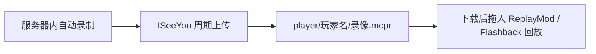

<div align="center">
  
  <h1>QY-PLAYER-MCPR</h1>
  <p><b>清屿服务器 · 玩家录像（<code>.mcpr</code>）自动同步仓库</b><br>
  <sub>由 ISeeYou 插件自动推送 · 每次录制生成一个独立的录像文件</sub></p>
</div>

<div align="center">

[](https://www.aqcraft.cn/)
[](https://qm.qq.com/q/UtMBMfsr8m)
[](https://github.com/MCQingYu-Team/QingYu-docs)
[](https://github.com/MC-XiaoHei/ISeeYou)
[](https://cubexmc.org/lookup)

</div>

---

## 关于本仓库

**QY-PLAYER-MCPR** 是清屿服务器的**玩家录像仓库**：玩家在服务器中的每一次录制，都会由 [ISeeYou](https://github.com/MC-XiaoHei/ISeeYou) 录像插件自动推送到这里，无需任何手动操作。



> [!NOTE]
> 本仓库公开可访问，录像可能包含聊天记录、建筑坐标等游戏内信息，请勿将其用于与清屿无关的用途。

## 目录结构

```text
.
└── player/                          # 全部玩家录像
    ├── <玩家名>/                     # 每位玩家一个文件夹
    │   ├── 2026-10-03@19-33-25-704-bb4ab025.mcpr
    │   └── ...                      # 按录制时间递增
    └── ...
```

- 文件名格式：`<日期>@<时间>-<随机后缀>.mcpr`，天然按录制时刻排序
- 每次录制都会生成新的文件，不会覆盖旧录像

## 如何回放录像

| 步骤 | 做法 |
| --- | --- |
| ① 定位 | 进入 `player/<你的昵称>/`，找到对应日期的 `.mcpr` 文件 |
| ② 下载 | 点开文件 → 右上角 **Download raw file** |
| ③ 回放 | 安装 [ReplayMod](https://www.replaymod.com/)（或 Flashback），把 `.mcpr` 拖进游戏窗口即可播放 |

> [!TIP]
> 录像较多时，可以把整个仓库 `git clone` 到本地慢慢翻看。

## 说明

- 录像由服务器插件自动推送，**请勿手动修改或删除 `player/` 下的文件**
- 只有**录制完成的**录像才会被上传，正在录制中的文件会被自动跳过
- 仓库仅做存储与分发，录像版权归录制玩家与清屿服务器所有

## 相关链接

| 类别 | 地址 |
| --- | --- |
| 官网 | <https://www.aqcraft.cn/> |
| QQ 群 | <https://qm.qq.com/q/UtMBMfsr8m> |
| 规则与条例 | <https://github.com/MCQingYu-Team/QingYu-docs> |
| 封禁系统 | <https://ban.aqcraft.cn/> |
| 组织主页 | <https://github.com/MCQingYu-Team> |

<div align="center">

<sub>清屿服务器 · 生电 | 红石科技 | 技术向生存</sub><br>
<sub>© 清屿运营团队 · 录像由 ISeeYou 插件自动同步</sub>

</div>